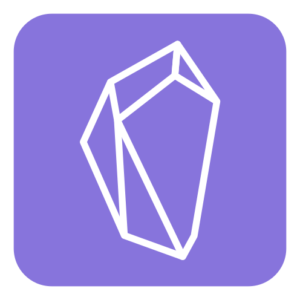
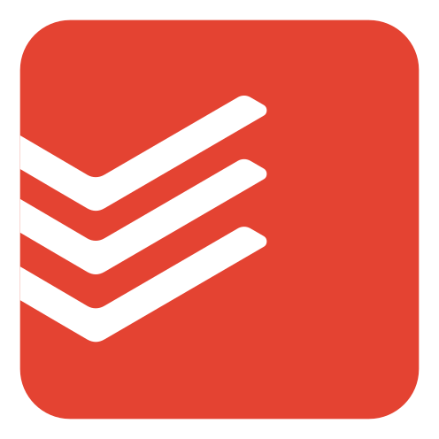
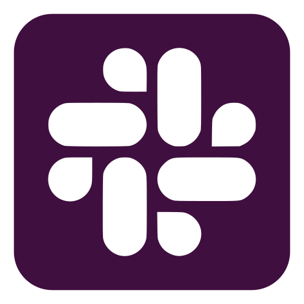
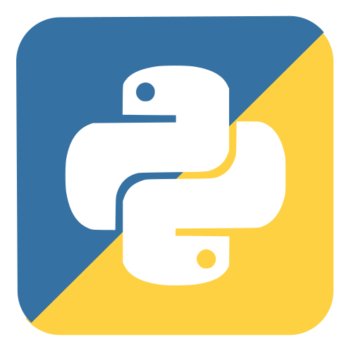
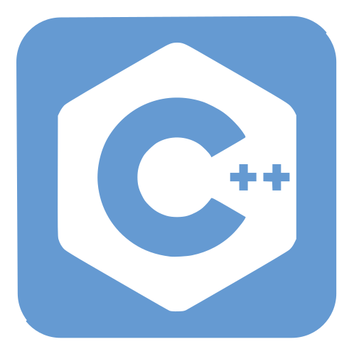
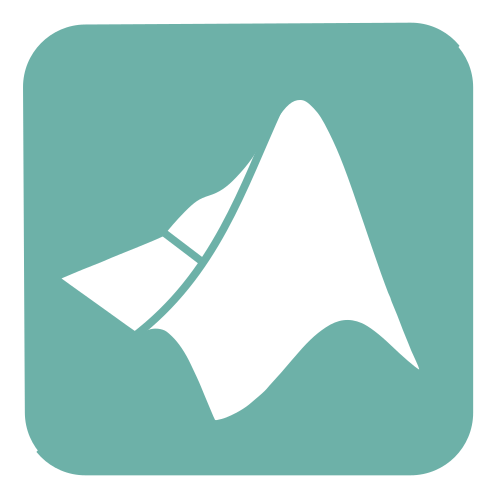
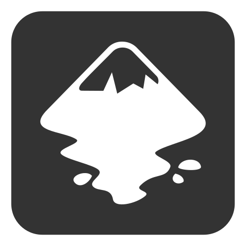
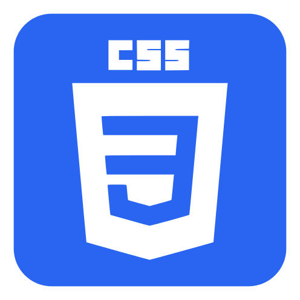
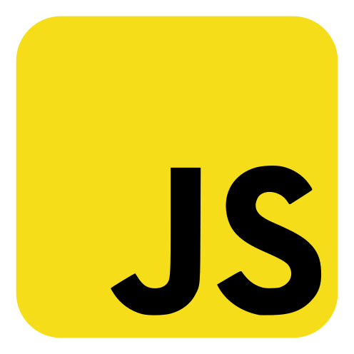

# Technical-icons
Set of technical icons

## Github
 https://github.com/

## Obsidian
 https://github.com/obsidianmd

## Todoist
 https://todoist.com/features

## Slack
 https://slack.com/

## Python
 https://www.python.org/

## Cpp
 https://en.wikipedia.org/wiki/C%2B%2B

## NetLogo
 https://ccl.northwestern.edu/netlogo/

## Julia
 https://julialang.org/

## Matlab
 https://www.mathworks.com/products/matlab.html

## R
 https://www.r-project.org/

## Inkscape
 https://inkscape.org/

## Html
 https://en.wikipedia.org/wiki/HTML5

## Css
 https://en.wikipedia.org/wiki/CSS_(disambiguation)

## JS

## Php
 https://en.wikipedia.org/wiki/PHP

## Latex
 https://en.wikipedia.org/wiki/LaTeX
